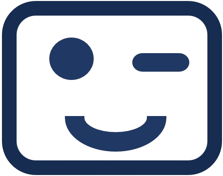

<p align="center">
  
</p>


# neurablink

neurablink is a lightweight tool designed to remind you to blink while using your screens. By encouraging regular blinking, neurablink can help you counteract common discomforts associated with long periods of screen time, such as eye strain and dry eyes. 

The tool will dim your screen(s) after you have not blinked for a while and clears after you blink again without interrupting your working tasks. This automatically conditions you to blink more often in a comfortable way. On the GUI, you can adjust the sensitivity of blink detection and the countdown until the tool dims your screen. The included real-time visual feedback helps you to find the settings that fit your eyes. 

## Why neurablink?
From Cleveland Clinic's information on computer vision syndrome ([source](https://my.clevelandclinic.org/health/diseases/24802-computer-vision-syndrome)):
> "Normally, you naturally blink about 18 to 22 times per minute. You need to blink enough to keep your eyes lubricated. But when using a computer, most people only blink three to seven times per minute. Screen use may also cause incomplete blinking. This means you only partly close your eye when you blink. Not blinking fully or often enough can cause the surface of your eyes to dry out."

neurablink helps address this by re-conditioning you to blink more often.

## Features

 Real-time blink detection 

 Lightweight so you can work on your main tasks

 Smooth blink reminder by dimming your screen without interrupting your workflow

 Visual feedback to find the setting that suits you best

 Customizable sensitivity and blink countdown

 Works with multiple screens

 No GPU needed

 Open source and free


## Getting started

Download the latest release for your platform:

**[Download for Windows](https://zenodo.org/api/records/14497598/draft/files/neurablink_windows_1_2.exe/content)** 


**[Download for Linux](https://zenodo.org/api/records/14497598/draft/files/neurablink_ubuntu_1_2/content)** (note: currently, Wayland is not supported - X11 works fine)


Note: macOS is not supported yet. Linux version tested on Ubuntu 22.04 and Debian 12.

### For Builders / Contributors

#### Clone the Repository
```bash
git clone https://github.com/psykidlearn/neurablink.git
```

#### Create a Virtual Environment
```bash
conda create --name neurablink python=3.10
```

#### Install Dependencies
```bash
pip install -r requirements.txt
```

#### Adapt Code and Build an Executable
```bash
python build_application.py
```

#### Run for Debugging
To run the application for debugging purposes:
```bash
python src/debug.py
```

## Disclaimer
neurablink is not a medical product, and it makes no health claims. It is designed solely for personal use as a wellness tool and is not a substitute for professional medical advice. Use neurablink at your own discretion and consult an eye care professional if you have concerns about your eye health.